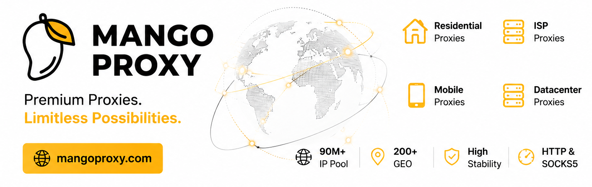

# The Web Scraping Wiki

A structured, LLM-maintained knowledge base on anti-bot systems, scraping tools, browser fingerprinting, and proxy infrastructure. It compiles what we tested across 300+ [The Web Scraping Club](https://thewebscraping.club/) articles since 2022, cross-referenced and updated daily.

New here? Read [About.md](About.md) for what this is, where the sources come from, how it is maintained, and how to open it as an Obsidian vault.

The Web Scraping Wiki is free to read and stays that way thanks to the companies below. If you want your product in front of a technical audience that scrapes for a living, [get in touch](mailto:pier@thewebscraping.club).

## Great Sponsors

<!--
  GREAT SPONSORS — placeholder rows.
  To add a real sponsor, duplicate a <tr>, swap the logo (images/...), the URL, the name, and the copy.
  Logo cell is fixed at 200px; the pitch goes on the right.
-->
<table>
  <tr>
    <td width="200">
      
    </td>
    <td>
      <a href="mailto:pier@thewebscraping.club"><b>Your company here</b></a> a short description of what you offer and why it matters to people scraping the web.
    </td>
  </tr>
  <tr>
    <td width="200">
      
    </td>
    <td>
      <a href="mailto:pier@thewebscraping.club"><b>Your company here</b></a> a short description of what you offer and why it matters to people scraping the web.
    </td>
  </tr>
</table>

<i>Want your logo here? <a href="mailto:pier@thewebscraping.club">Reach out</a> and we will add you.</i>

## Awesome Sponsors

<!--
  AWESOME SPONSORS — logo links, optional one-line offer under the logo.
  To add a real sponsor, duplicate an <a>, swap the logo (images/...) and the URL.
  MangoProxy: added 2026-09-02, scheduled for removal on the 2026-10-02 run.
-->

  
   
  <a href="https://mangoproxy.com/?utm_source=thewebscrapingclub&utm_medium=partner&utm_campaign=thewebscrapingclub_github"><b>MangoProxy</b> — code <b>SCRAPING</b> for 8% off ISP Static proxies</a>

  
  
  

<i>Want your logo here? <a href="mailto:pier@thewebscraping.club">Reach out</a> and we will add you.</i>

## Index

The full, page-by-page catalog lives in [index.md](index.md), regenerated on every daily run. The shortcuts below jump straight to each section.

- [Entities](index.md#entities) (117) — tools, libraries, stealth browsers, anti-bot products, and proxy networks, one page each.
- [Concepts](index.md#concepts) (29) — detection techniques, patterns, and domain ideas, with the signals they rely on.
- [Comparisons](index.md#comparisons) (3) — side-by-side analyses when the question is "which one and when?".
- [Timelines](index.md#timelines) (1) — how a moving target evolved across sources over time.
- [Canvases](index.md#visual-maps-and-views) (1) — JSON Canvas landscape maps, rendered as interactive whiteboards in Obsidian.
- [Views](index.md#visual-maps-and-views) (4) — Obsidian Bases live queries that surface pages by frontmatter.

For everything else (sources, maintenance pipeline, Obsidian setup, error reporting, license), see [About.md](About.md).
