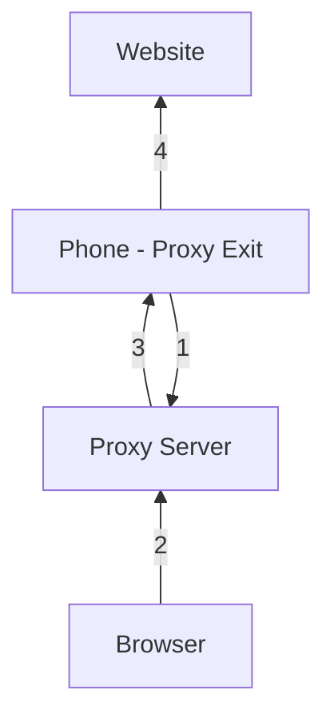

# Proxy Server

## What it is

This project, `vgaj/proxy`, provides a way to route web traffic from a browser through an Android phone's mobile data connection. It is designed as a simple alternative to commercial VPN services for accessing geo-restricted content, provided you have a trusted contact with an Android phone.

## How it works

### Components:
- **Proxy Server**: A service that brokers connections between the browser and phone.
- **Proxy Exit**: An Android app that runs on the phone.
- **Browser**: Configured to use the Proxy Server as an HTTP proxy.

### Flow:
1. The Proxy Exit app connects to the Proxy Server, making the phone available as a proxy exit node.
2. When the browser needs to make an HTTP request, it sends it to the Proxy Server.
3. The Proxy Server forwards the request to the phone over the established connection.
4. The phone fetches the content and returns it through the server to the browser.

## TWSC experience

Not yet tested by TWSC.

## Related

- [Mobile Proxy Farming](../concepts/mobile-proxy-farming.md)
- [Web Unblockers](../concepts/web-unblockers.md)
- [Proxy Fundamentals](../concepts/proxy-fundamentals.md)

## Sources

- [https://github.com/vgaj/proxy](https://github.com/vgaj/proxy)
